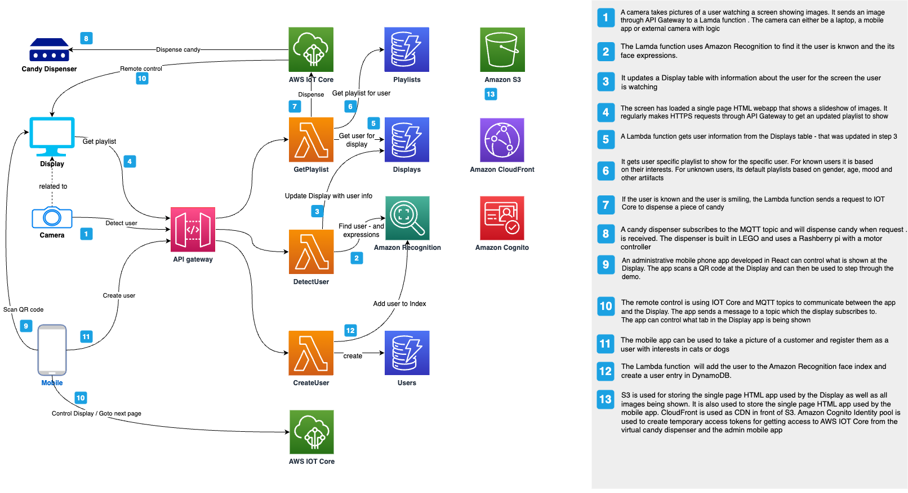

# Smile And Get Candy

## Introduction
This project demonstrates how to build a minimal Digital Signage HTML client showing a carousel of images based on the user watching the display. A camera will be monitoring the user watching. Images being shown on the display will change based on the user appearance, e.g. if wearing glasses, smiling or having a beard.
It is possible to register a user with name, photo and interest in e.g. dogs or cats. After registration, the user will be recognized by the display and will be welcomed with a personal message and pictures that the user is interested in will be shown, i.e. cats or dogs. If the user smiles, a connected IOT device (A candy dispenser) will dispense a piece of candy and the user will get a message about this on the display.

The solution is intended to be fun and engaging for a customer, and will be a great conversation starter at events such as AWS Summits. The solution shows the power of AWS AI services and how easy it is to integrate them into a solution and innovate fast. The solution is based on Amazon Recognition to identify people faces in a picture taken by the camera, and to identify characteristics of the faces using the detectUser API. In addtion it uses Amazon Rekognition custom index to be able to identify specific known people.
In addtion to showing the power of Amazon Recognition, it also illustrates a complete serverless solution that is fast to develop and deploy and where you only pay for when then solutionn is being used. It also shows how you can integrate an IOT device in the form of a candy dispenser that has been built with a Raspberry pi, a step motor and motor controller and Lego. 
By demonstrating the solution, you can talk about AI services (Amazon Recognition), serverless technologies (Lambda, DynamoDB, API Gateway) and IOT Core, and how all these technologies play together. The solutiun had been implemented with CDK and this can foster a discussion on IAC.

See a demo here:

[](https://youtu.be/5pDqFPZGAMQ)


## Solution Architecture 



## How to setup
You can setup the stack in your AWS account from your local machine. Unfortunately you cannot do it through Cloud9 as you must be authorised through the mwinit command line tool that requires your security usb key. You need to setup and configure the AWS CLI, install the CDK CLI as well, and install Node. With Cloud9 all required software is already there and have access to your account, but you cannot use this as long as the repository is hosted in GitLab.
You need to have access to AWS internal gitlab server at https://gitlab.aws.dev/ and first authenticate through the mwinit command line program to be able to access the repository

Follow the steps below to deploy the stack to your environment. 

```
$ git clone git@ssh.gitlab.aws.dev:sbrahe/smileandgetcandy.git
$ cd smileandgetcandy/cdk
$ ./deploystack.sh
```
This will use CDK to deploy the complete stack, write the URL to cloudfront to the console as well as opening a browser with the cloudfront URL. It will also create a dist-iot directory with files that can be deployed to a raspberry pi that will subscribing to an IOT topic and rotate a connected motor when it receives an event

### Setup the Rasperry Pi (Optional)
If you have a raspberry pi connected to a motor controller, have SSH enabled on it, and have a computer on the same network, you can easily install and setup the candy dispenser software after having run the deploystack.sh script. The script creates a dist-iot directory with code and certificates necessary for the pi.

The dist-iot directory contains the custom code and IOT certicate you need at the raspberry phi, and an install.sh script. Open a terminal, cd to the iot-dist directory and execute the install.sh script on your machine. Your machine must be on the same network as the raspberry pi and you must know its IP address, and user/password, and it must have SSH enabled. The install script will copy the files to the pi and will setup an automated service that will start the listening application for the IOT topic and will rotate a connected motor when it receives a notification. The code contains the URL to your IOT endpoint and the client certificate generated when you deployed the stack through the deploystack.sh script.

You will need the following to build the lego dispenser similar to this project
* Raspberry pi. The Raspberry pi used for this project is the model 3B version with 1gb ram. 
* Step motor and a motor controller
* Breadboard and cabels.
* External power supply for the motor controller. We have used a ....
* Lego bricks
* Raspberry pi running Rasberrian
* SSH access setup
* Python installed
* Motor libraries installed


## How to demonstrate
For most fun user experience, you can demonstrate the solution with an external display showing images through the cloudfront ULR created from the stack deployment, a raspberry pi connected to a motor controller and step motor and a Lego candy dispenser, and a mobile device with the admin client where you can register a user. However, if you dont have raspberry pis available, or a mobile device to install the app, the solution can also be demonstrated through a web browser since the web client contains both the image display, a camera page, a user registration page and a virtual candy dispenser.

### Explanation of the web application
The web application is developed in React and contains five separate pages for demonstration.

* An Architecture page decribing the archicture of the solution. Can be used to explain the solution without the need for additional diagrams
* A Playback page showing dynamic images. This is the page that a customer will see. This page will activate the camera and start to take images
* A Playback and Candy dispenser page. This is used when you want to show the virtual candy dispenser at the same time as showing images.
* A User Registration page where you can register a user and a photo. This will add the face to the Amazon Recognition face index.
* A Technical Dashboard page that will show the playback, the camera and the candy dispenser all at once including the response messsages they receive from the API calls. This can be used to explain the technical details behind the communication.
* A Settings page where you can set the ID of the display. It is by default 5, and is the number that connects the display, the camera and the IOT device. You can share the URL for the cloudfront distribution with the audience, and they can set a random number and try out the demo themselves.
* There are also a separate Camera and a Candy Dispenser page, and these are mostly useful when developing and extending the solution.

### Demo Using the web brower
#### Prepare
* Select the Playback menu item. First time, accept the browser request to use your web camera. The camera will take a photo every 5th second. You should see a slide show of the universe, and if you have glasses, a beard or start to smile, you should see other images. Try to wear/unwhere a pair of glasses. See that content chenges. Then try to smile for 5 seconds and verify that you see images of smiling people. This page can be shown to a customer and you can explain that it adapts to the user watching by using AI - and here we are using AI as as service - the Amazon Recognition service.
* Depending on the discussion, you can either switch to the Architecture page and explain the architecture of the solution, or you can ask the customer if they want to see face recognition.
* Switch to the Playback and Dispenser page to show the virtual candy dispenser (unless you have a physical one), and talk about face recognition, IOT connected devices, and that the user can get a piece of candy.
* Select the User Registration page, take a picture of the customer, choose an interest and click register.
* Select the Playback or the Playback and Dispenser page. Get the customer to smile. Now you should see pictures of interest and the candy dispenser should give you a piece of candy.
* Switch to the user registration page and delete the user.


### Camera
The camera client takes a picture of the customer watching the screen every 5 seconds and sends a HTTP POST request to AWS cloud where the image is analysed and URLs for pictures to show based on the customers face is returned to the client.

The HTTP Post request is sent to API gateway that has a HTTP API defined to execute a Lambda function. The Lambda function receives the image of the customer in base64 encoding and uses the Amazon Rekognition SDK to get information back about the customer at the image. Based on the Rekognition response, the Lambda code contains business logic to decide on what images to show to the user. It creates a response and sends back to the calling client that then shows the images.


## Web application development
The webapp is developed in React and is located under the ClientSide folder. Start the webapp locally after running the deploystack.sh the first time by excuting 'npm start' under ClientSide folder. It will start the web browser and load the application. Navigate to the Playback menu and verify that it is showing Universe is Amazing. If you get 404 messages and the endpoint is not known, make sure that the .env file contains the URL of your API gateway endpoint. It should have been inserted by the deploystack.sh script.


## Setup Raspberry Pi
The code under IOT folder can be used by one or two raspberry pis to act as camera that submits images to API gateway, and to act as candy dispenser that listens on IOT core topic and rotates connected motor when a message arrive.
In order to install and setup the raspberry pi, follow the steps below
* Run the cdk/deploystack.sh script. It will create the AWS stack and will create a directory cdk/dist-iot with files that need to be placed at the raspberry pi, including generated certificate related files and using the correct API gateway URL for API calls.
* Run the cdk/dist-iot/install.sh file. It will copy all necessary files to the raspberry pi under the /home/admin/dispenser folder and it will setup a service that will automatically start the dispenser

The iot-dist folder files have been generated from the source files located in the IOT top folder. The dispenser.py file is the main file for listing on a MQTT topic, and it will use the motor.py program to rotate a connected step motor 360 degrees. 


# Possible extensions to this scenario
This very simple POC can be extended with many scenarios. Some ideas include:
* Only allow authorized digital signage screens to access content
* When autorizing a digital signage screen, give it a name/id - this will make it possible to decide what to show on individual displays
* Administration client to create and maintain playlists and business rules in general and for specific displays
* Collect user statistics including reoccuring customers - and use analytics to analyse data
* Use GenAI to generate images for the customer based on their interests